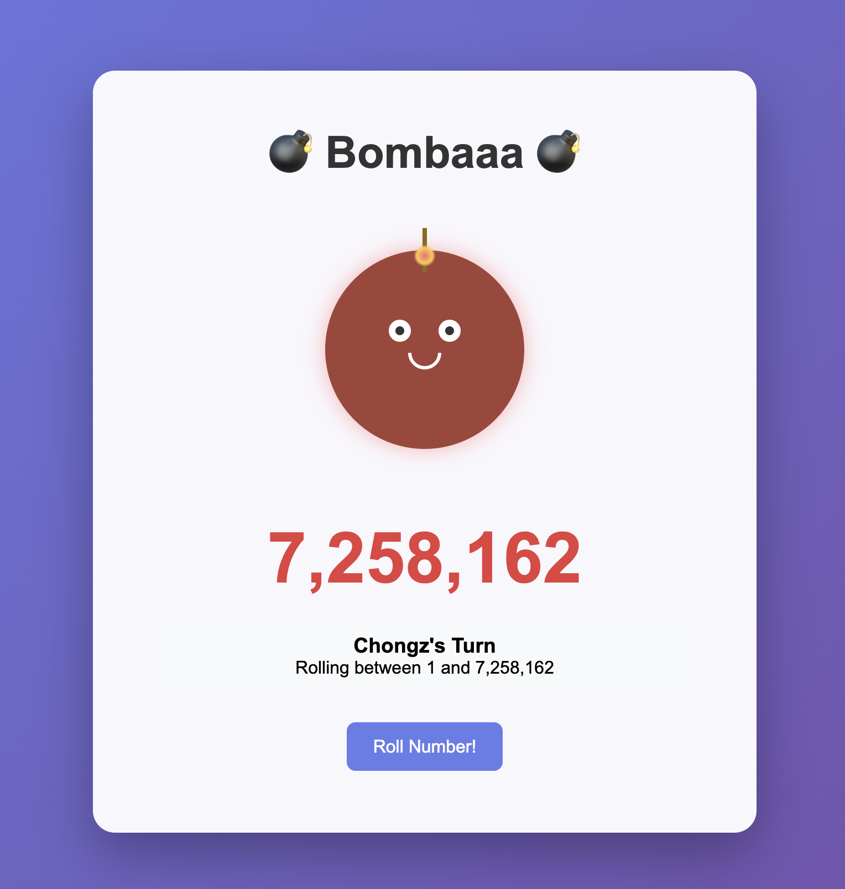

# 💣 Bombaaa Game

***Written by Claude 4 Opus, Inspired by the 2025 WSOP trip with the lads***

An explosive multiplayer number guessing game built with vanilla HTML, CSS, and JavaScript. Players take turns rolling numbers, trying to avoid rolling a 1 and exploding the bomb!



## 🎮 How to Play

1. **Setup Players**: Add 2 or more players with custom names
2. **Set Starting Number**: Choose a starting number (2-10,000,000) or randomize it
3. **Take Turns**: Each player rolls a number between 1 and the current maximum
4. **Avoid the Bomb**: The rolled number becomes the new maximum for the next player
5. **Game Over**: The player who rolls 1 explodes the bomb and loses!

## 🚀 Quick Start

### Option 1: Test the Complete Version
1. Open the `bombaaa-complete.html` file in any web browser
2. This single file contains the entire game for easy testing

### Option 2: Run the Modular Version
1. Download all files maintaining the folder structure:
```
bombaaa/
├── index.html
├── styles/
│   ├── main.css
│   ├── animations.css
│   └── responsive.css
└── js/
    ├── gameState.js
    ├── gameLogic.js
    ├── ui.js
    └── main.js
```
2. Open `index.html` in a web browser

## 🧪 Local Testing

### Prerequisites
- Any modern web browser (Chrome, Firefox, Safari, Edge)
- No server required - runs entirely client-side

### Testing Steps

#### Desktop Testing
1. **Open the game**:
   ```bash
   # Navigate to the project folder
   cd bombaaa
   
   # Open in your default browser (Mac)
   open index.html
   
   # Open in your default browser (Windows)
   start index.html
   
   # Or simply double-click index.html
   ```

2. **Test all features**:
   - [ ] Add multiple players (3-6 players recommended)
   - [ ] Enter custom player names
   - [ ] Set custom starting numbers
   - [ ] Use "Randomize Starting Number" button
   - [ ] Toggle "Randomize player order" checkbox
   - [ ] Play through complete games
   - [ ] Test different danger levels (watch background colors change)
   - [ ] Trigger explosion animation (roll 1)
   - [ ] Use "Play Again" to reset

#### Mobile Testing
1. **Local mobile testing**:
   ```bash
   # Serve locally to test on mobile devices
   # Option 1: Python 3
   python -m http.server 8000
   
   # Option 2: Python 2
   python -m SimpleHTTPServer 8000
   
   # Option 3: Node.js (if you have it)
   npx http-server
   
   # Option 4: PHP (if you have it)
   php -S localhost:8000
   ```

2. **Access on mobile**:
   - Find your computer's local IP address
   - On mobile browser, go to `http://[YOUR_IP]:8000`
   - Example: `http://192.168.1.100:8000`

3. **Mobile-specific tests**:
   - [ ] Touch interactions work smoothly
   - [ ] Buttons are large enough to tap easily
   - [ ] Text is readable without zooming
   - [ ] Game fits different screen sizes
   - [ ] Portrait and landscape orientations
   - [ ] Animations run smoothly on mobile
   - [ ] No horizontal scrolling issues

#### Browser Compatibility Testing
Test in multiple browsers:
- [ ] **Chrome** (latest)
- [ ] **Firefox** (latest)
- [ ] **Safari** (latest)
- [ ] **Edge** (latest)
- [ ] **Mobile Safari** (iOS)
- [ ] **Chrome Mobile** (Android)

#### Performance Testing
1. **Open browser developer tools** (F12)
2. **Check Console tab** for any errors
3. **Monitor Performance**:
   - Animations should be smooth (60fps)
   - No memory leaks during extended play
   - Fast response to user interactions

### Debug Mode
For debugging, open browser developer tools and check:

```javascript
// Check game state in console
console.log(GameState);

// Check if all modules loaded
console.log(typeof GameLogic, typeof UI);

// Monitor events
console.log('Game started:', GameState.gameActive);
```

## 📱 Responsive Breakpoints

The game adapts to different screen sizes:

- **Large screens** (1200px+): Enhanced bomb size and spacing
- **Desktop** (600px-1199px): Standard layout
- **Tablet** (481px-600px): Slightly reduced elements
- **Mobile** (480px and below): Optimized for touch with larger buttons

## 🎨 Features

### Visual Effects
- Dynamic background colors based on danger level
- Bomb animations (flashing, shaking)
- Explosion effects with particle animation
- Smooth number rolling animations
- Responsive design for all devices

### Game Mechanics
- Configurable starting numbers (2 to 10 million)
- Player name customization
- Random player order option
- Progressive tension as numbers get lower
- Visual feedback for high/low rolls

### Technical Features
- Modular JavaScript architecture
- No external dependencies
- Mobile-optimized touch interface
- Cross-browser compatibility
- Lightweight and fast loading

## 🏗️ Architecture

### File Structure
- **`index.html`**: Main HTML structure
- **`styles/main.css`**: Core styling and layout
- **`styles/animations.css`**: All animations and visual effects
- **`styles/responsive.css`**: Mobile and responsive design
- **`js/gameState.js`**: Game state management
- **`js/gameLogic.js`**: Core game mechanics
- **`js/ui.js`**: User interface updates
- **`js/main.js`**: Main controller and event handlers

### Design Patterns
- **State Management**: Centralized game state in `GameState` object
- **Separation of Concerns**: Logic, UI, and state are separate modules
- **Event-Driven**: User interactions trigger state changes and UI updates
- **Responsive Design**: Mobile-first approach with progressive enhancement

## 🚀 Deployment

### Local Development
1. No build process required
2. Simply open `index.html` in a browser
3. All assets are self-contained

### Production Deployment
See the [Deployment Guide](deployment-guide.md) for:
- Netlify hosting setup
- Custom domain configuration with Namecheap
- DNS configuration
- HTTPS setup

### Quick Deploy Options
- **Netlify**: Drag and drop the project folder
- **Vercel**: `npx vercel` in project directory
- **GitHub Pages**: Push to GitHub and enable Pages
- **Surge**: `npx surge` in project directory

## 🐛 Troubleshooting

### Common Issues

**Game not loading**
- Ensure all files are in correct folder structure
- Check browser console for errors
- Try opening in incognito/private mode

**Animations not working**
- Check if CSS files are loading properly
- Test in different browsers
- Ensure JavaScript is enabled

**Mobile touch issues**
- Clear browser cache
- Test in different mobile browsers
- Check for viewport meta tag

**Performance issues**
- Close other browser tabs
- Test on different devices
- Check for browser extensions interfering

### Getting Help
1. Open browser developer tools (F12)
2. Check Console tab for error messages
3. Take screenshots of any issues
4. Note browser version and device type

## 📄 License

This project is open source. Feel free to modify and distribute.

## 🤝 Contributing

Contributions are welcome! Areas for improvement:
- Additional animations and effects
- Sound effects and music
- Multiplayer online functionality
- Tournament mode
- Statistics tracking
- Custom themes

---

**Enjoy playing Bombaaa! 💣💥**
